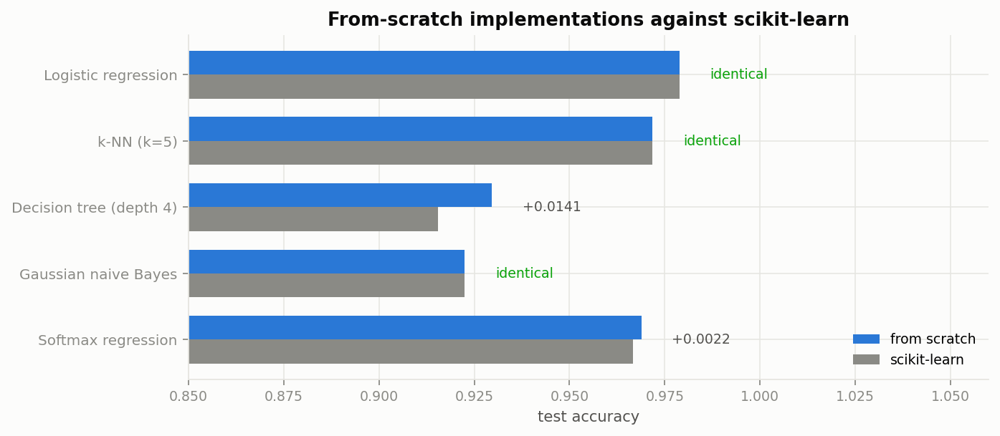
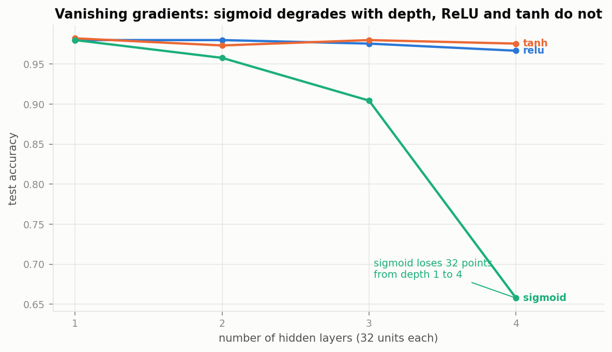
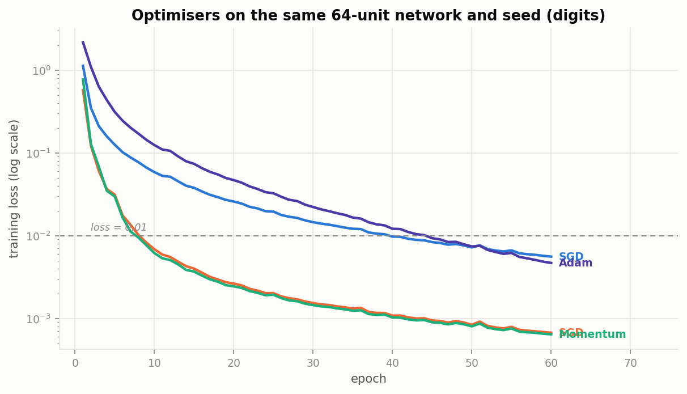
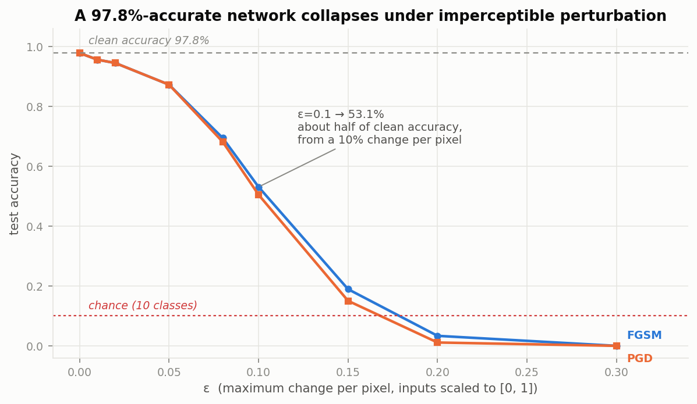
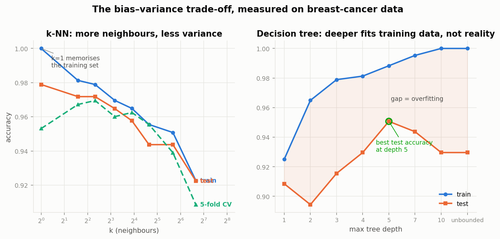
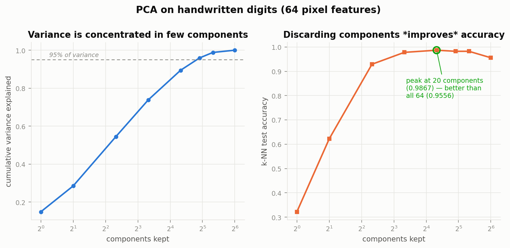
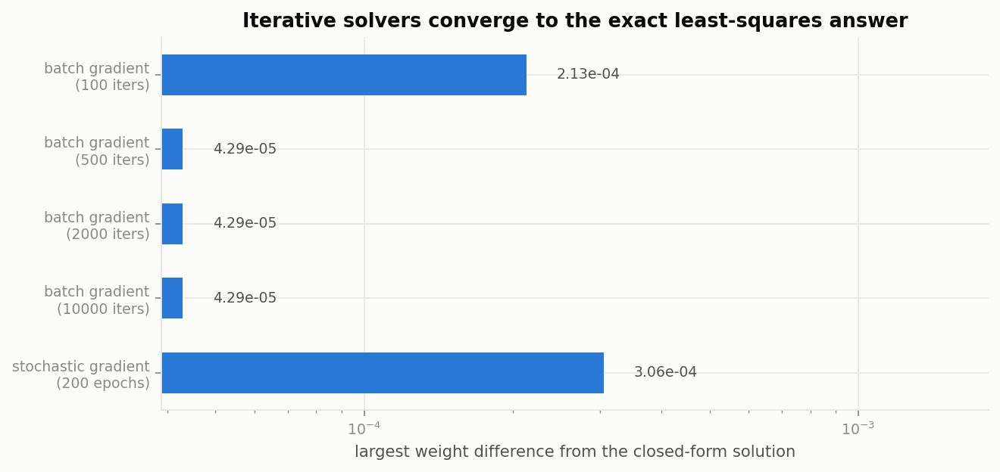
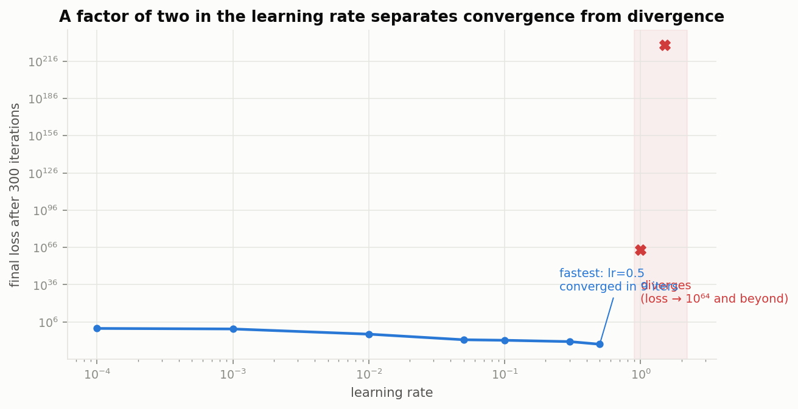

# Machine Learning from Scratch

Thirteen classical ML algorithms and a neural network built with **numpy only**,
each verified against its scikit-learn counterpart. The backpropagation is checked
against finite differences rather than trusted, and the network is then attacked
with adversarial examples to show what test accuracy does not tell you.

The measurements are the point, and so are the failures. **[LEARNING_LOG.md](LEARNING_LOG.md)**
documents three bugs in my own code, one hypothesis that did not survive contact
with data, and a diagnostic that handed me a confident wrong answer.


[](https://github.com/Shehan121/ml-from-scratch/actions/workflows/tests.yml)

> scikit-learn appears **only** in `tests/` as the reference, and in `scripts/` to
> load the bundled datasets. Nothing in `src/mlkit/` imports it.

---

## Verified against scikit-learn



| model | mine | scikit-learn | difference |
|---|---:|---:|---:|
| Logistic regression | 0.9789 | 0.9789 | **identical** |
| k-NN (k=5) | 0.9718 | 0.9718 | **identical** |
| Gaussian naive Bayes | 0.9225 | 0.9225 | **identical** |
| Linear regression (R²) | 0.517748 | 0.517748 | **identical** |
| Softmax regression | 0.9689 | 0.9667 | +0.0022 |
| Decision tree (depth 4) | 0.9296 | 0.9155 | +0.0141 |

Four match exactly. Linear regression agrees to six decimals because both solve the
same normal equations. The tree differs because CART must break ties between splits
of equal impurity gain, and any consistent rule is valid — so an exact match was
never the right expectation. PCA components match to 1e-10, and every metric matches
to floating-point precision.

---

## The neural network

### Backpropagation, verified not asserted

Every gradient is checked against a central finite difference. Worst relative error
across nine architecture/activation combinations:

| architecture | ReLU | sigmoid | tanh |
|---|---:|---:|---:|
| 5 | 6.9e-08 | 4.4e-09 | 4.3e-09 |
| 6×4 | 8.9e-10 | 1.4e-07 | 1.6e-08 |
| 8×6×4 | 4.5e-09 | 7.2e-08 | 1.1e-08 |

Anything below 1e-7 is correct. This includes the L2-penalty gradient and `dL/dX`,
the input gradient the adversarial attacks need.

Getting the checker itself right took two attempts — my first version was wrong for
every layer after the first, in a way that looked like a tolerance issue. See
[log §2](LEARNING_LOG.md#2-my-gradient-checker-was-itself-subtly-wrong).

### Vanishing gradients, measured



Test accuracy on digits, 32 units per layer:

| hidden layers | ReLU | tanh | sigmoid |
|---|---:|---:|---:|
| 1 | 0.9800 | 0.9822 | 0.9800 |
| 4 | 0.9667 | 0.9756 | **0.6578** |

Sigmoid loses **34 percentage points** by four layers; ReLU and tanh lose 1–2.
Its derivative peaks at 0.25, so gradients shrink at least 4× per layer travelling
back. At four layers — nothing by modern standards — the network is already crippled.

### Optimisers



Epochs to reach a training loss of 0.01, same network and seed:

| optimiser | rate | epochs | test accuracy |
|---|---|---:|---:|
| Momentum | 0.05 | **8** | 0.9822 |
| SGD | 0.5 | 9 | 0.9889 |
| SGD | 0.1 | 40 | 0.9867 |
| Adam | 0.001 | 45 | 0.9889 |

**Adam was the slowest here** — 5.6× more epochs than momentum. Not a flaw: its
default 0.001 is conservative, and per-parameter scaling earns its keep when
gradient magnitudes differ across layers, which barely happens in a two-layer
network on clean features.

---

## Adversarial robustness

The security half, and the reason test accuracy is not a safety property.



| ε (max change per pixel) | FGSM | PGD |
|---|---:|---:|
| 0.00 | 0.9777 | 0.9777 |
| 0.10 | 0.5306 | 0.5046 |
| 0.20 | 0.0334 | 0.0111 |
| 0.30 | **0.0000** | **0.0000** |

A network at **97.8%** accuracy drops to **53%** when every pixel may move by 10%
of its range, and to **zero** at 30% — worse than random guessing, because the
perturbation actively steers predictions wrong.

FGSM is one step along `sign(dL/dx)`. That gradient is already computed by
backpropagation on its way to the first layer and normally discarded, which is why
the attack costs about as much as one training step. PGD iterates it and is
consistently stronger at equal budget (1.1% vs 3.3% at ε=0.2).

---

## Classical algorithms

### The bias–variance trade-off from two directions



k=1 scores a perfect **1.0000 on training data** and 0.9789 on test — memorisation,
not learning. An unbounded tree also reaches 1.0000 train while test peaks at depth
5 (0.9507) and *falls* to 0.9296 when grown fully.

### PCA: discarding variance improved accuracy



| components | variance kept | k-NN accuracy |
|---|---:|---:|
| **20** | **89.4%** | **0.9867** |
| 64 (all) | 100% | 0.9556 |

Twenty of sixty-four components beat all of them by **3.1 points** while throwing
away 10.6% of the variance. The discarded components are mostly noise, and k-NN
degrades in high dimensions regardless.

### Three solvers, one answer



Least squares solved by normal equation, batch gradient descent and SGD agree to
4.3e-05 and 3.1e-04 respectively. **Agreement between independent solvers is a
correctness test that needs no reference implementation** — the most useful
technique I picked up here.

### The learning rate has no gentle edge



| rate | outcome |
|---|---|
| 0.5 | converged in **9** iterations |
| 1.0 | diverged to 1.3e+64 |
| 2.0 | overflowed to infinity |

A factor of two separates the sweep's fastest convergence from total divergence.

### Accuracy is not a metric on imbalanced data

| model | accuracy | precision | recall | F1 | ROC-AUC |
|---|---:|---:|---:|---:|---:|
| always predict majority | **0.9918** | 0.000 | 0.000 | 0.000 | — |
| logistic regression | 0.9959 | 1.000 | 0.500 | 0.667 | **1.000** |

A model ignoring its input entirely scores 99.18%. Note the AUC of 1.000 with
recall of 0.5: the *ranking* is perfect, so the missed positives are a **threshold**
problem, not a model problem — and the fix is free.

---

## What's implemented

**Supervised** — linear regression (normal equation, batch GD, SGD), ridge,
logistic regression, softmax regression, k-NN, CART decision tree, Gaussian naive
Bayes, MLP classifier

**Unsupervised** — k-means with k-means++, PCA via SVD

**Machinery** — SGD / Momentum / Adam, finite-difference gradient checking,
StandardScaler, MinMaxScaler, stratified splits, K-fold

**Metrics** — accuracy, confusion matrix, precision / recall / F1 (macro, micro,
weighted, per-class), MSE, RMSE, MAE, R², log loss, ROC curve, ROC-AUC

**Security** — FGSM, PGD, robustness curves

---

## Tests

```
124 passed in 3.96s
```

Correctness means **agreeing with a reference**: models against scikit-learn,
metrics against `sklearn.metrics`, gradients against finite differences, the
O(n log n) path against the O(n²) one.

Several tests pin down failures rather than successes:

| Test | What it pins down |
|---|---|
| `test_relu_propagates_nan_rather_than_laundering_it` | `np.where(x>0,x,0)` turns NaN into 0.0 and hides divergence |
| `test_nan_fraction_distinguishes_divergence_from_dead_units` | `dead_fraction` alone cannot tell them apart |
| `test_divergence_raises_instead_of_returning_a_chance_level_model` | Silent failure is worse than an exception |
| `test_detects_a_deliberately_wrong_gradient` | If the checker cannot fail, it tests nothing |
| `test_accuracy_is_misleading_on_imbalanced_data` | 99.5% accuracy with F1 = 0 |
| `test_kmeans_plus_plus_helps_where_clusters_are_separable` | Asserts only the claim that survived a sample-size sweep |
| `test_epsilon_breaks_scale_invariance_for_tiny_gradients` | Adam's `eps` is not free |
| `test_test_set_is_not_forced_to_zero_mean` | The signature of a correctly fitted scaler |
| `test_sigmoid_is_stable_at_extremes` | The naive formula returns NaN |

---

## Running it

Python 3.10+.

```bash
pip install -r requirements.txt

pytest                              # 124 tests
python scripts/run_experiments.py   # measure everything -> reports/*.csv
python scripts/make_figures.py      # reports/figures/*.png
```

Checking that backprop is right:

```python
from mlkit.gradcheck import check_gradients
from mlkit.neural_net import MLPClassifier
import numpy as np

X = np.random.default_rng(0).normal(size=(8, 4))
y = np.random.default_rng(0).integers(0, 3, size=8)

model = MLPClassifier(hidden=(6, 4), seed=0)
model._build(4, 3)
print(max(check_gradients(model, X, y).values()))   # 1.36e-09
```

Attacking a trained model:

```python
from mlkit.adversarial import fgsm
from mlkit.metrics import accuracy

X_adv = fgsm(model, X_test, y_test, epsilon=0.1, clip=(0, 1))
print(accuracy(y_test, model.predict(X_adv)))       # 0.53, from 0.98 clean
```

---

## Honest limitations

- **These are teaching implementations.** scikit-learn is Cython-backed, handles
  sparse input, edge cases and multiple solvers. Use it in production; use this to
  understand it.
- **The decision tree is O(features × thresholds × samples) per node** — every
  midpoint is evaluated with no histogram binning or presorting, so it is far
  slower than a real implementation on wide data.
- **No convolutional layers, dropout, or batch normalisation.** The MLP is fully
  connected, which is why digits (64 features) is the largest problem here.
- **The gradient checker is O(number of parameters) forward passes**, so it is
  only practical on deliberately tiny networks. It verifies the derivation, not
  the trained model.
- **Adversarial results are for an undefended MLP.** No adversarial training or
  certified defence is implemented — the point is to measure the vulnerability, not
  to fix it.
- **All datasets are small and clean** (150–1,797 samples, bundled with
  scikit-learn). No missing values, no categorical encoding, no class-imbalance
  handling beyond the one demonstration.

## Project structure

```
src/mlkit/
├── metrics.py          from the definitions, verified against sklearn.metrics
├── preprocessing.py    scalers, stratified split, K-fold
├── linear.py           least squares three ways, ridge
├── logistic.py         binary + softmax, numerically stable sigmoid/softmax
├── knn.py              vectorised distances via the ||a-b||² identity
├── kmeans.py           Lloyd's algorithm, k-means++ seeding
├── tree.py             CART with gini/entropy
├── naive_bayes.py      Gaussian, in log space
├── pca.py              SVD-based, deterministic component signs
├── neural_net.py       layers, backprop, MLP, divergence guard
├── optimizers.py       SGD -> Momentum -> Adam, in that order for a reason
├── gradcheck.py        central finite differences
└── adversarial.py      FGSM, PGD
scripts/                run_experiments.py, make_figures.py
tests/                  124 tests
reports/                measurements + 8 figures
LEARNING_LOG.md         what the measurements corrected
```

## Related

Built after **[algorithms-from-scratch](https://github.com/Shehan121/algorithms-from-scratch)**,
which applies the same approach — measure, do not assert — to sorting, graphs and
dynamic programming.

## Author

**Shehan Nimsara** — B.Sc. Software Design (International), TH Aschaffenburg
